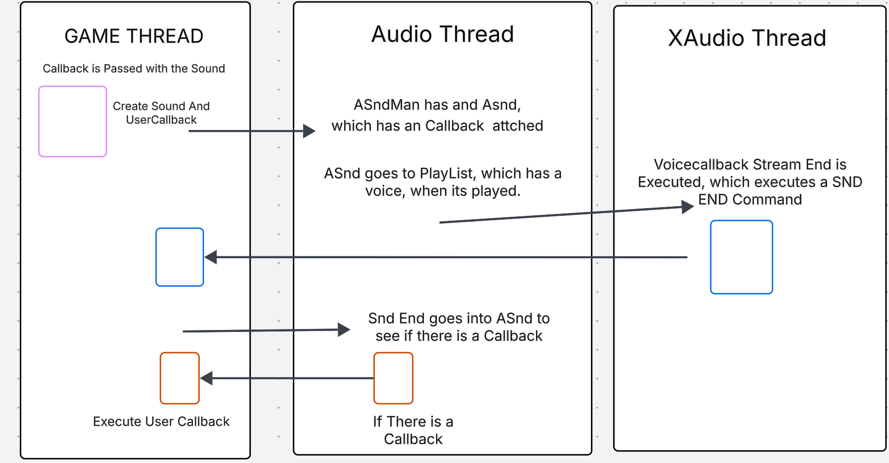

Welcome to my game development portfolio! Here you can find a collection of the games I've developed, along with information about my skills and experience in game development.

## About Me

I’m a Game Programmer in training at DePaul University, with 3 years of industry experience split between game development and software engineering. I specialize in C#, Unity, C++, and Unreal Engine, and I’ve worked across both 2D and 3D projects—from building gameplay systems to refining player interactions. What excites me most is crafting worlds and mechanics that pull players in and keep them engaged, blending technical precision with creative design.

For futher information you can refer my [Resume](./Sai%20Sushant%20Koranne-Resume.pdf).

## My Work

### Game Engine By Dx11 Abstraction using C++ (Inprogress)

1. **DirectX 11 Rendering Pipeline:** Architected a high-performance custom rendering pipeline in C++ by abstracting DirectX 11, providing low-level control over GPU resources, swap chains, and shaders.
2. **Custom Math Library:** Built a SIMD-optimized math library from scratch (Vectors, Matrices, Quaternions) to support real-time 3D rendering and scene transformations.
3. **PCS Tree Architecture:** Designed a Parent-Child-Sibling (PCS) Tree data structure for the scene graph, ensuring efficient spatial management and hierarchical transformation propagation.
4. **GLB Asset Parsing:** Integrated tinygltf to parse industry-standard .glb files, extracting raw mesh data, texture UVs, and animation hierarchies for engine use.
5. **Protocol Buffer Serialization:** Developed a custom converter tool using Google Protocol Buffers to serialize raw asset data into optimized, engine-readable binary messages.
6. **Efficient Runtime Loading:** Engineered a custom File Library that deserializes binary assets at runtime, significantly reducing load times compared to standard text-based formats.
7. **Skeletal Animation System:** Implemented a complete animation system for skinned meshes, utilizing the custom binary format to perform real-time bone transformations.
8. **Core Transformation Systems:** Programmed foundational 3D systems for Translation, Rotation, and Scaling, demonstrating a deep practical application of linear algebra and scene management.

Video:
<iframe src="https://www.youtube.com/embed/04EIQK7dUYI" width="640" height="480" allow="autoplay"></iframe>

### Maniacs(Unity)

Description: 

1. This Game is a Horror Survival Game.
2. The Player is spanned in a dark Location.
3. Zombies spawn from random places and start chasing the player, and try to attack the Player.
4. Player can collect diffent types of melee/shooting weapons to kill the zombies.

Video: 
<iframe src="https://www.youtube.com/embed/YiSdhmQq9RY" width="640" height="480" allow="autoplay"></iframe>

### Little-Adventure(Unity)

Description: 

1. This Game is a Small Adventure Game.
2. The Game has 3 Regions.
3. Each Regions Spwans Enemies when a player entered a trigger point.
4. When the player destroyes the Enemies in that regions the gateway to the next region opens.
5. When the player destroyes the enimes in all regions the game is completed.  

Video: 
<iframe src="https://www.youtube.com/embed/MS0hBhmG8SY" width="640" height="480" allow="autoplay"></iframe>

### Multiplayer Top Spin Game(Unity)

Description: 
1. It’s an multiplayer game for android. 
2. API used for multiplayer is PUN2.
3. Here for multiplayer connection RPC is used. 
4. Here to player battle with each other with Tops.
5. When player dash against each other, they lose speed.
6. Whenever a player's speed becomes zero, he loses.

Video: 
<iframe src="https://www.youtube.com/embed/XFNV0KTawU4" width="640" height="480" allow="autoplay"></iframe>

### Bomberman(Unity)

Description: 
1. Its a clone of the classic Bomberman Game.
2. The Player must navigate a maze-like level while laying bombs to defeat enemies and destroy obstacles.
3. The goal is to eliminate all the enemies and reach the exit within a time limit.
4. Here, at first the enemies move randomly.
5. When there are only 2 enemies remaining, they move away from the player as far as possible.

Video: 
<iframe src="https://www.youtube.com/embed/Dw_dUJbwEas" width="640" height="480" allow="autoplay"></iframe>

### Snake Game(Unity)

Description: 

1. The Classic Snake Game Made in Unity.
2. But here the game made in 3d.
3. As the Snake Collects Food its size keps growning.
4. There are also enemy Snake in the Game.
5. If the player attacks the body of the enemy the player looses.
6. If the the Player attcts the head of the enemy the enemy is dead.

Video: 
<iframe src="https://www.youtube.com/embed/xPQqw40An-s" width="640" height="480" allow="autoplay"></iframe>

### Obstacles Path(Unreal)

Description: 
1. Many Obstacles are placed in in the pathway of the Player.
2. There Object can Move Vertically, Horizontally, and also can Rotate and sweep.
3. The player has to go through these obstacles and reach his final destination.

Video: 
<iframe src="https://www.youtube.com/embed/wqA9bi4vpoI" width="640" height="480" allow="autoplay"></iframe>

### Warehouse Wreckage(Unreal)

Description: 
1. Its a Simple Projectile based Game.
2. Spawn and Launch Spherical Projectiles.
3. Hit Some Cans using those Projectiles and the Cans Fall Down.

Video:
<iframe src="https://www.youtube.com/embed/cjC4mtLGov8" width="640" height="480" allow="autoplay"></iframe>

### Racing Game Using Reinforcement Learning(Unity)

Description: 

1. A flight racing game, where the enemy agents are trained using Reinforcement Learning. 
2. A positive Reward is given whenever the agent passes through the check point.
3. If the agent misses the check point a negative reward is awarded.

### Space Invaders Game(C#- Custom Game Engine)

Descrption:

1. Design Pattern-Driven Architecture: Designed the core architecture of the Space Invaders game using C#, employing various design patterns including Factory for dynamic object creation (bullets, enemies), Observer for event handling (score updates, game state changes), and State for managing different enemy behaviors or game modes.
2. Modular & Extensible Gameplay: Utilized design patterns to ensure modularity and extensibility of game systems, allowing for easy integration of new enemy types, power-ups, or gameplay mechanics without extensive code refactoring.
3. Real-time Performance & Behavior: Implemented design patterns like Strategy for different enemy movement or attack patterns, ensuring flexible and optimized real-time behavior within the custom C# engine. According to Medium, these patterns help build scalable, maintainable, and flexible games.
4. Efficient Object Management: Applied patterns such as Object Pool (implicitly or explicitly) to manage bullet and enemy instances, optimizing performance by reducing object instantiation and destruction overhead.

Video:
<iframe src="https://www.youtube.com/embed/rV2u6_DlC0s" width="640" height="480" allow="autoplay"></iframe>

### Audio Engine Usimg C++ in Multithread Aritechture

1. Developed a C++ multithreaded runtime audio engine library, utilizing the XAudio2 API for low-level audio processing and playback.
2. Designed and implemented multithreaded components, including custom handles, inter-threading queuing system, and thread tracking for efficient audio management.
3. Integrated advanced features like asynchronous real-time loading/streaming and a dynamic preemptive priority system for seamless audio experiences.
4. Enabled flexible audio control through application-defined user callbacks and data-driven script playback.
5. Validated engine robustness through a series of mini-demos, proving the feasibility of the multithreaded audio solution.

Architecture:

Video:
<iframe src="https://www.youtube.com/embed/pFoSYXbLc_w" width="640" height="480" allow="autoplay"></iframe>

## Skills

- Programming Languages: 
C, C++, Java, C#
- Game Engines: Unity, Unreal
- VSC : Git, Helix P4V

## More Works

You can refer my [GitHub](https://github.com/spoiler335/) profile for my futher works.

## Contact Me

- [LinkedIn](https://www.linkedin.com/in/sai-sushant-a107a51a4)
- [Mail](mailto:sushantsaige@gmail.com)
- [Phone](tel:+13126878202)
- [WhatsApp](https://wa.me/+13126878202)

Feel free to reach out to me if you have any questions or would like to collaborate on a game development project!
